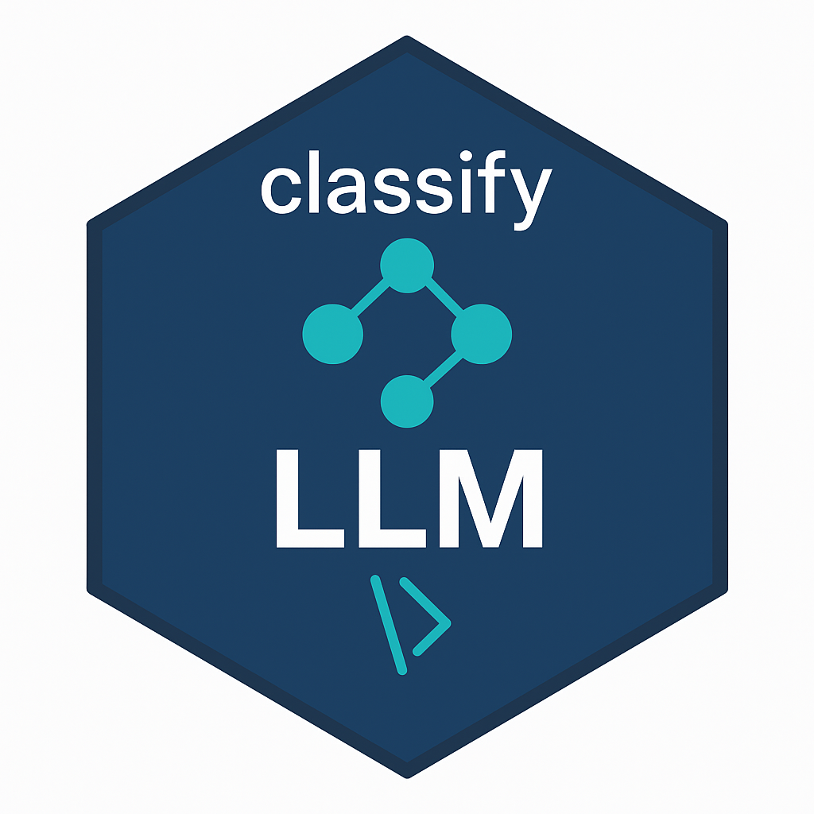

# classifyLLM <a href="https://dante042.github.io/classifyLLM"></a>
# 

**classifyLLM** brings the power of modern large language models (LLMs) directly into tidyverse data pipelines.
Unlike most wrappers around LLM APIs, which work through isolated prompts or custom loops, classifyLLM is designed from the ground up to integrate naturally with R’s data-analysis grammar.It provides a clean, transparent, and auditable interface for classifying text into predefined categories — directly within `mutate()` or `across()`  so that each classification behaves like any other vectorized transformation in a tidy workflow.

You don’t need to manage API calls, parse JSON responses, or build machine-learning models: the package handles all communication, batching, and parsing automatically, returning results as tidy columns that blend seamlessly with existing datasets. This makes ***classifyLLM*** especially valuable for analysts who want to apply LLM-based reasoning at scale while preserving the clarity, reproducibility, and pipeline logic of the tidyverse.

---

## 🧭 So why this package

Analysts and researchers often need to classify open-ended text fields:
- survey responses or interview transcripts  
- “other” categories in datasets  
- qualitative notes from reports  
- lists of job titles, symptoms, or objects  

Traditional NLP workflows require model training, feature engineering, or external tools.  
`classifyLLM` lets you use an LLM (e.g. GPT-4) to perform classification directly, within your data pipeline.

---

## 🚀 Features

| Feature | Description |
|----------|-------------|
| 🧹 **Tidyverse integration** | Works naturally inside `mutate()`, `across()`, or `map()` pipelines. |
| ⚙️ **Deterministic and auditable** | Set temperature = 0 for reproducible results. |
| 📦 **Batching and rate control** | `batch_size` and `delay` prevent rate-limit errors. |
| 🔐 **Secure key management** | Use `set_openai_key()` or environment variable `OPENAI_API_KEY`. |
| 🧪 **Testing support** | API calls skipped if key not set; mock mode planned for CI. |
| 💬 **Fallback logic** | Normalizes and corrects near matches, prevents blank outputs. |

---

## 🧩 Example

```r
# install
remotes::install_github("dante042/classifyLLM")

# loading
library(classifyLLM)
library(dplyr)

Sys.setenv(OPENAI_API_KEY = "sk-...")
# or classifyLLM::set_openai_key()

tibble::tibble(animal = c("siamese kitty", "golden retriever", "parakeet")) |>
  mutate(species = classify_llm(
    animal,
    categories = c("cat", "dog", "bird"),
    model = "gpt-4o-mini",
    temperature = 0
  ))
